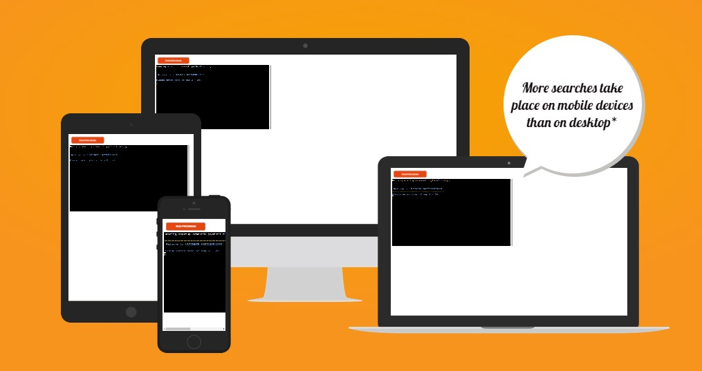
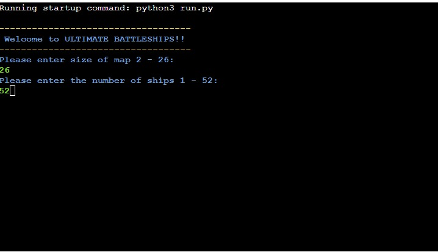
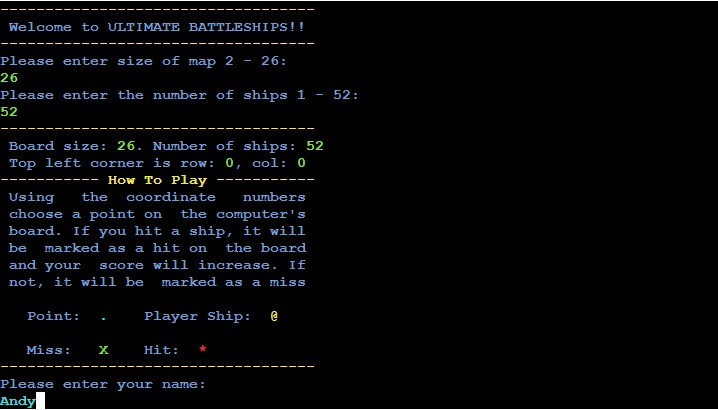
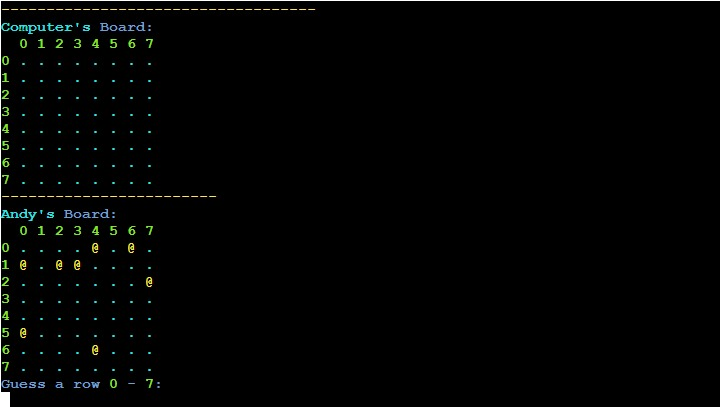
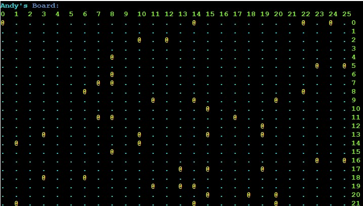
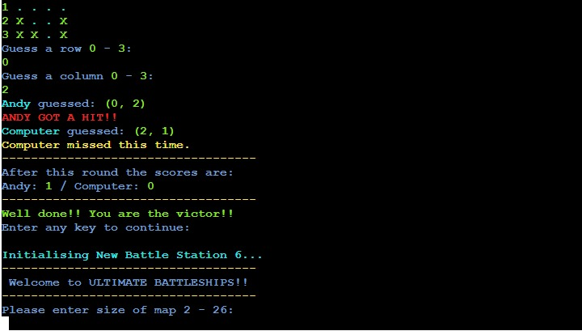
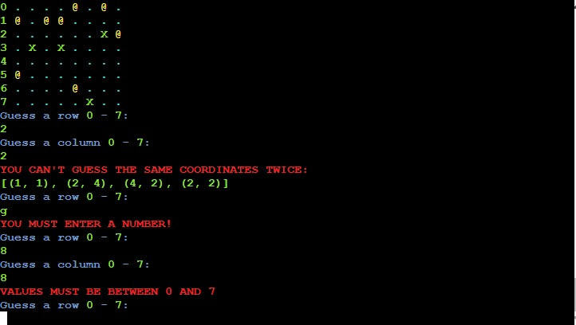
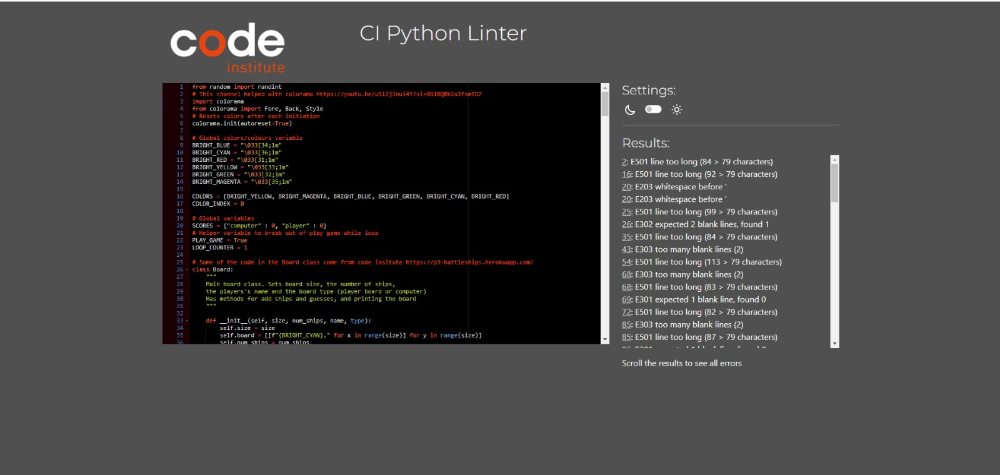
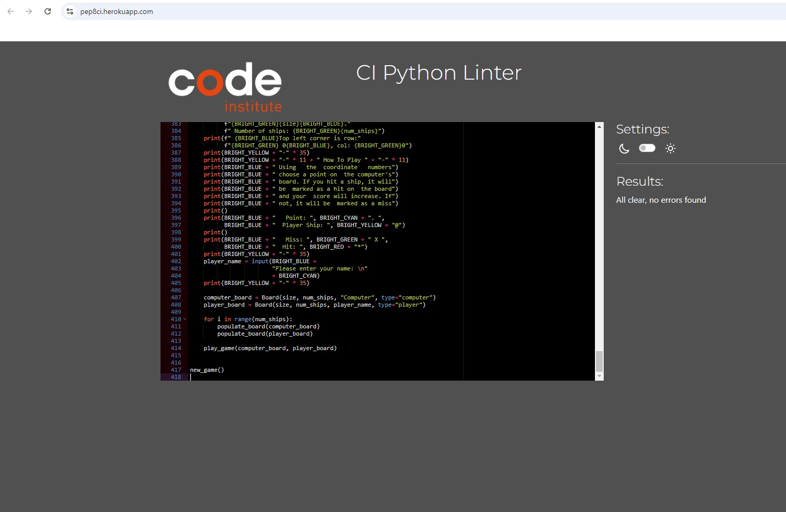

# ULTIMATE Battleships
Welcome to my version of the Code Institute Battleship game! You can find the original version [here](https://p3-battleships.herokuapp.com/)

This is a Python terminal game that runs in the Code Institute mock terminal on Heroku.

Initially, I was unsure on what direction to take for my Project 3, so I decided to work on the Battleship game using the data model provided by Code Institute and fill in the blanks. However, the task turned out to be more challenging than I expected. Probably spending more time trying to break out of a while loop then needed. Nevertheless, I got there in the end and added some features along the way.

This project has increased my understanding of data models, and allowed me to grow in to a better developer.  

[Here is the live version of my project](https://my-battleships-version-dbd5056212a9.herokuapp.com/)

## How to play
The game is based on the classic Battleship concept. You can find more about it on [Wikipedia](https://en.wikipedia.org/wiki/Battleship)

In this version, the player can input the size of the board, which ranges from 1 to 26 to fit within the Heroku terminal's. The player will also input the number of ships to add, with a minimum of one ship and a maximum determined by the board size.

Then the player will be prompted with details about the board and a brief description of how to play.

The player can see where their ships are, indicated by a `@`, but cannot see where the computer's ships are.

Guesses are marked on the board withan `X`. Hits are indicated by `*`.

The player can then input there name, and the boards will be generated.

The player and the computer then take turns to make a guess and sink each other's battleships.

The winner is the player who sinks all of thier opponent's battleships first.

## Features

- **Colorama**
  - The first noticeable difference I implemented was adding Colorama to introduce different colors, making the game more visually appealing and allowing the user to easily distinguish between different outputs.
- **Board size and ship input**
  - Next, I allowed the player to input the size of the board they want to play and the number of ships they would like to add.

  

- **How to play**
  - I then added a brief description of how to play, following the original feature that displays the board size, the number of ships, and the row and column details.

  

- **Numbers for navigating**
  - I added numbers to the board to help determine the coordinates, making it easier for the player to navigate, enhancing the overall player experience. These numbers will change positions depending on the size of the board.

  - Small board

  

  - Large board

  

- **Outputs to user**
  - Keeps track of scores
  - prompts the player of the computers coordinates
  - outputs message if player or computer has a Hit or miss
  - prompts player if win, draw or loses
  - Has a tally up message for each initialisation of new battle station, with a color change

  

- **Input validation and error-checking**
  - You cannot enter the same coordinates twice
    - Keeps a track of coordinates and displays to user 
  - You must enter a number
  - Values must be between 0 and `board.size`

  

## Data Model
## Testing
## Bugs
### Solved Bugs
- **Stuck in a While Loop:**
    When playing the original game, I noticed that once either the player or the computer had won, the terminal only prompted to continue and did not give the option to exit. This was a feature I was looking to add. The issue I found was that when playing the first match, leaving the game was not a problem, but if you continued to play a new game and then went to leave the second game, the break function would only throw you out of the loop and into the function, thereby repeating itself and leaving you stuck in the game.

    I had a tutoring session with Code Institute to help me with the debugging, adding print statements in each function to help indicate where I was at within the loops and functions. After many hours of trying different methods, the only way I found that could make it work was by adding a global variable, PLAY_GAME, which was set to true unless the player prompted otherwise, thus taking them out of the game. This global PLAY_GAME variable is used to close off the while loop if it does not return true.

    What I found interesting was that the function would continue to try and enter the while loop for the number of times a new game was played. So, I added a global LOOP_COUNTER and a COLOR list that would change the color of a print statement and count up each time it was printed, indicating the number of times it had taken to break out of the loop, or how many times the player had started a new game.

- **Giving the same Random Values**
    Fixed a bug where the ship was not being appended to the board correctly. I forgot that the random function can generate the same values multiple times, which sometimes resulted in only 3 ships being printed instead of 4. To fix this, I put the random functions in a while loop with an if statement.

After uploading to Heroku, I realized that the logic I used to break out of the while loop in the play_game function was incorrect. Instead of crashing the game to access the terminal, it should remain in a continuous loop. So, I called the new_game function instead and adjusted the output messages for a better user experience. I also decided to keep the loop counter and color list to add a bit of character and as a reminder to myself to push to Heroku earlier for testing.

### Remaing Bugs
- No bugs remaining
## Testing
### Manual Testing
- Vigorous manual testing to ensure everything functions as expected
### Validator Testing
- PEP8
  - There were errors with the [PEP8 Validator](https://pep8ci.herokuapp.com/), mainly related to whitespace and excessive line lengths
    

  - All errors have been fixed
    

## Deployment
This project was deployed using Code Institute's mock terminal for Heroku.
- **Steps for deployment**
  - Fork or clone this [repository](https://github.com/AndyV773/battleships)
  - Create a new Heroku app
  - Add Config Var in Heroku's settings. The key is `PORT` and the value is `8000`
  - Set the buildbacks to `Python` and `NodeJS` in that order
  - Link the Heroku app to the repository
  - Click on **Deploy**

## Credits
- Code Institute for the [ULTIMATE Battleships game](https://p3-battleships.herokuapp.com/) and the deployment terminal
- [Colorama](https://pypi.org/project/colorama/) for colors in terminal
- [W3S](https://www.w3schools.com/)
- [Stack Overflow](https://stackoverflow.com/)
- [Python Forum](https://python-forum.io/index.php)